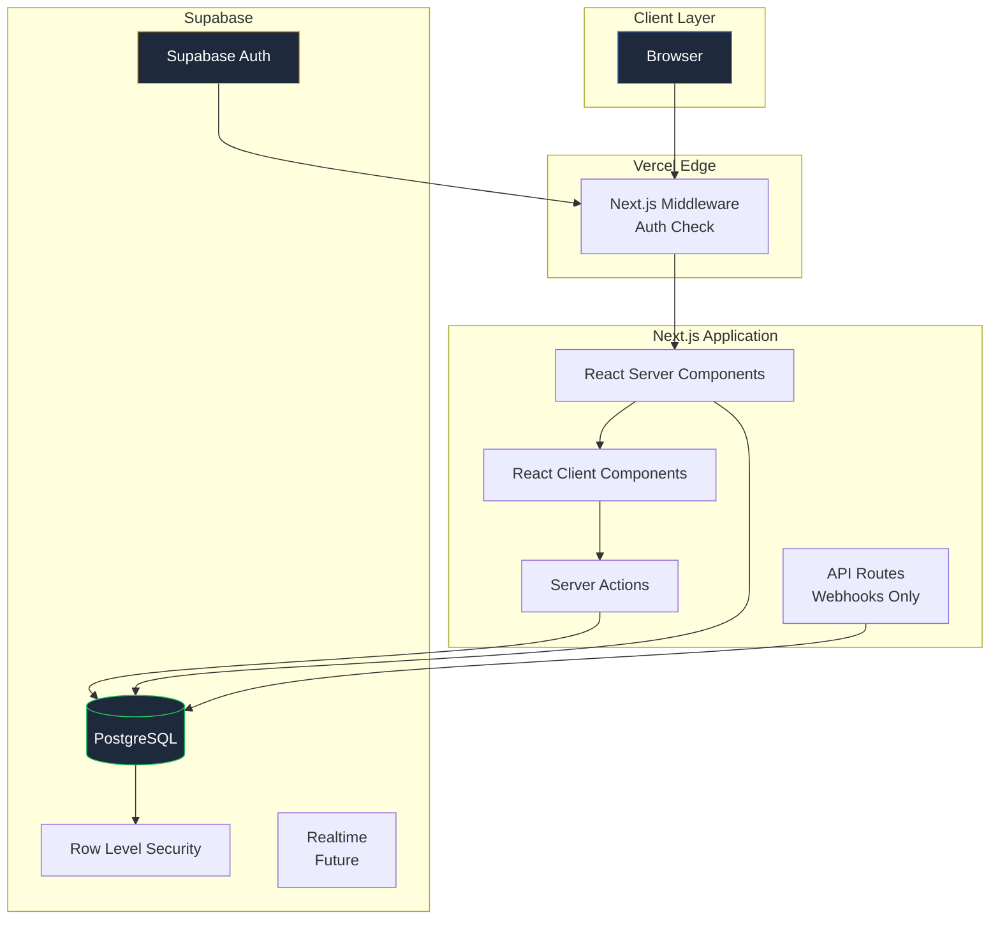
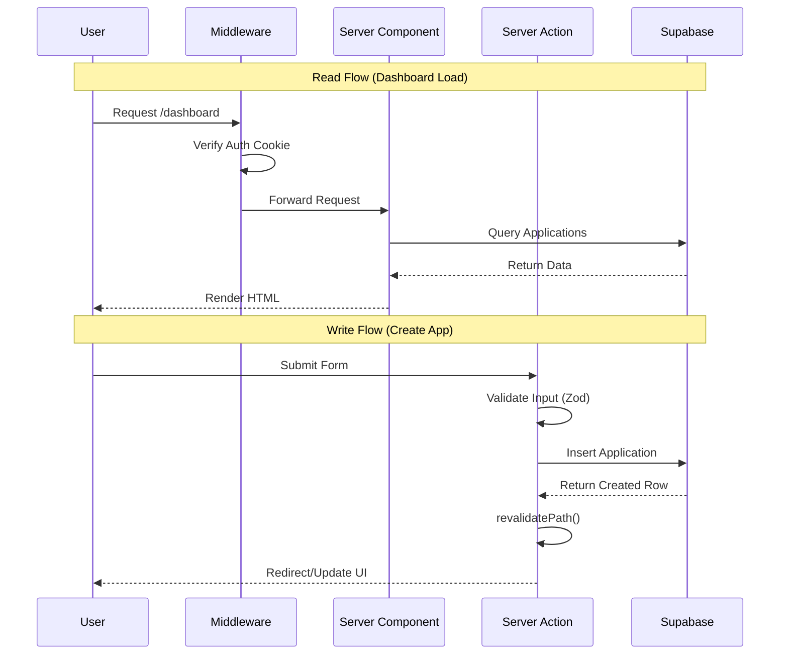
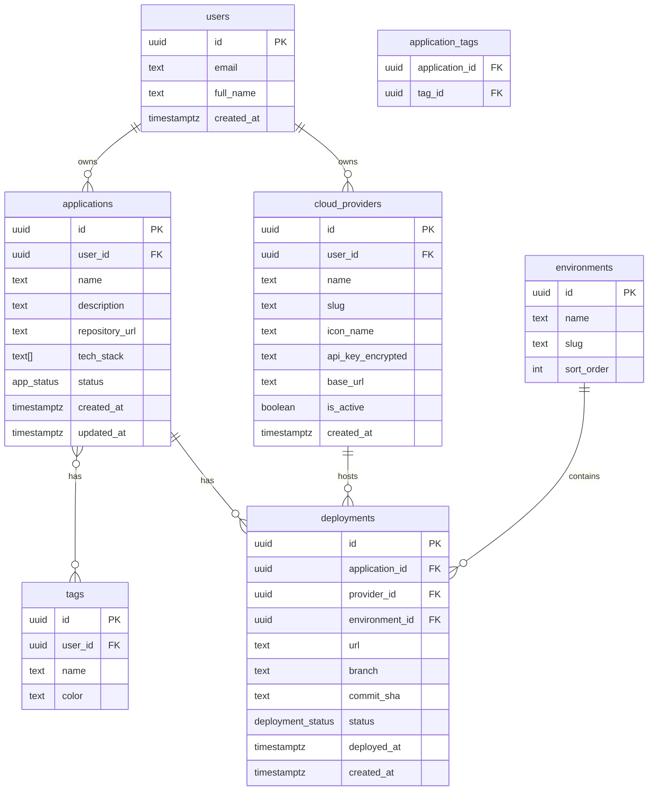

# jb-cloud-app-tracker Architecture

Version: 1.0.0
Date: 2026-01-26
Status: Proposed

## Table of Contents

1. [Overview](#1-overview)
2. [System Architecture](#2-system-architecture)
3. [Data Models](#3-data-models)
4. [API Structure](#4-api-structure)
5. [File/Folder Structure](#5-filefolder-structure)
6. [Key Features](#6-key-features)
7. [Security](#7-security)
8. [Architecture Decision Records](#8-architecture-decision-records)

---

## 1. Overview

### 1.1 Purpose

A personal web application to track and manage cloud applications across multiple providers (Vercel, Cloudflare, Railway, AWS, etc.). Provides a central dashboard for visibility into all deployed applications and their lifecycle.

### 1.2 Goals

- Single source of truth for all cloud applications
- Track deployments across environments (dev, staging, production)
- Monitor application status and health
- Organize apps with tags and categories
- Future: Webhook integration for automatic deployment tracking

### 1.3 Tech Stack

| Layer | Technology |
|-------|------------|
| Framework | Next.js 15 (App Router) |
| Database | Supabase (PostgreSQL) |
| Auth | Supabase Auth |
| Hosting | Vercel |
| UI | Tailwind CSS + v0 components |
| Icons | Lucide React |
| State | React Server Components + React Query |

### 1.4 Design System

```
Primary: Blue (#3b82f6)
Neutrals: Slate palette
Font (sans): Inter
Font (mono): JetBrains Mono
Mode: Dark mode with system preference detection
```

---

## 2. System Architecture

### 2.1 High-Level Architecture Diagram



### 2.2 Component Responsibilities

| Component | Responsibility |
|-----------|----------------|
| **Middleware** | Auth verification, route protection, redirects |
| **RSC (Server Components)** | Data fetching, initial render, SEO |
| **RCC (Client Components)** | Interactivity, forms, real-time updates |
| **Server Actions** | Mutations (create, update, delete) |
| **API Routes** | Webhook endpoints only (future) |
| **Supabase Auth** | User authentication, session management |
| **PostgreSQL** | Persistent data storage |
| **RLS** | Row-level security, data isolation |

### 2.3 Data Flow



---

## 3. Data Models

### 3.1 Entity Relationship Diagram



### 3.2 Database Schema (SQL)

```sql
-- Enable UUID extension
CREATE EXTENSION IF NOT EXISTS "uuid-ossp";

-- Enum types
CREATE TYPE app_status AS ENUM ('active', 'inactive', 'archived', 'maintenance');
CREATE TYPE deployment_status AS ENUM ('pending', 'building', 'deployed', 'failed', 'rolled_back');

-- Cloud Providers (user-customizable list)
CREATE TABLE cloud_providers (
    id UUID PRIMARY KEY DEFAULT uuid_generate_v4(),
    user_id UUID NOT NULL REFERENCES auth.users(id) ON DELETE CASCADE,
    name TEXT NOT NULL,
    slug TEXT NOT NULL,
    icon_name TEXT,
    api_key_encrypted TEXT,
    base_url TEXT,
    is_active BOOLEAN DEFAULT true,
    created_at TIMESTAMPTZ DEFAULT NOW(),
    UNIQUE(user_id, slug)
);

-- Environments (seeded, shared across users)
CREATE TABLE environments (
    id UUID PRIMARY KEY DEFAULT uuid_generate_v4(),
    name TEXT NOT NULL UNIQUE,
    slug TEXT NOT NULL UNIQUE,
    sort_order INT DEFAULT 0
);

-- Seed default environments
INSERT INTO environments (name, slug, sort_order) VALUES
    ('Development', 'development', 1),
    ('Staging', 'staging', 2),
    ('Production', 'production', 3);

-- Applications
CREATE TABLE applications (
    id UUID PRIMARY KEY DEFAULT uuid_generate_v4(),
    user_id UUID NOT NULL REFERENCES auth.users(id) ON DELETE CASCADE,
    name TEXT NOT NULL,
    description TEXT,
    repository_url TEXT,
    tech_stack TEXT[] DEFAULT '{}',
    status app_status DEFAULT 'active',
    created_at TIMESTAMPTZ DEFAULT NOW(),
    updated_at TIMESTAMPTZ DEFAULT NOW()
);

-- Deployments
CREATE TABLE deployments (
    id UUID PRIMARY KEY DEFAULT uuid_generate_v4(),
    application_id UUID NOT NULL REFERENCES applications(id) ON DELETE CASCADE,
    provider_id UUID NOT NULL REFERENCES cloud_providers(id) ON DELETE RESTRICT,
    environment_id UUID NOT NULL REFERENCES environments(id) ON DELETE RESTRICT,
    url TEXT,
    branch TEXT,
    commit_sha TEXT,
    status deployment_status DEFAULT 'deployed',
    deployed_at TIMESTAMPTZ DEFAULT NOW(),
    created_at TIMESTAMPTZ DEFAULT NOW()
);

-- Tags
CREATE TABLE tags (
    id UUID PRIMARY KEY DEFAULT uuid_generate_v4(),
    user_id UUID NOT NULL REFERENCES auth.users(id) ON DELETE CASCADE,
    name TEXT NOT NULL,
    color TEXT DEFAULT '#3b82f6',
    UNIQUE(user_id, name)
);

-- Application Tags (junction table)
CREATE TABLE application_tags (
    application_id UUID REFERENCES applications(id) ON DELETE CASCADE,
    tag_id UUID REFERENCES tags(id) ON DELETE CASCADE,
    PRIMARY KEY (application_id, tag_id)
);

-- Indexes for performance
CREATE INDEX idx_applications_user_id ON applications(user_id);
CREATE INDEX idx_applications_status ON applications(status);
CREATE INDEX idx_deployments_application_id ON deployments(application_id);
CREATE INDEX idx_deployments_provider_id ON deployments(provider_id);
CREATE INDEX idx_deployments_environment_id ON deployments(environment_id);
CREATE INDEX idx_deployments_deployed_at ON deployments(deployed_at DESC);
CREATE INDEX idx_cloud_providers_user_id ON cloud_providers(user_id);
CREATE INDEX idx_tags_user_id ON tags(user_id);

-- Updated_at trigger
CREATE OR REPLACE FUNCTION update_updated_at()
RETURNS TRIGGER AS $$
BEGIN
    NEW.updated_at = NOW();
    RETURN NEW;
END;
$$ LANGUAGE plpgsql;

CREATE TRIGGER applications_updated_at
    BEFORE UPDATE ON applications
    FOR EACH ROW
    EXECUTE FUNCTION update_updated_at();
```

### 3.3 Row Level Security (RLS)

```sql
-- Enable RLS on all tables
ALTER TABLE cloud_providers ENABLE ROW LEVEL SECURITY;
ALTER TABLE applications ENABLE ROW LEVEL SECURITY;
ALTER TABLE deployments ENABLE ROW LEVEL SECURITY;
ALTER TABLE tags ENABLE ROW LEVEL SECURITY;
ALTER TABLE application_tags ENABLE ROW LEVEL SECURITY;

-- Cloud Providers policies
CREATE POLICY "Users can view own providers"
    ON cloud_providers FOR SELECT
    USING (auth.uid() = user_id);

CREATE POLICY "Users can insert own providers"
    ON cloud_providers FOR INSERT
    WITH CHECK (auth.uid() = user_id);

CREATE POLICY "Users can update own providers"
    ON cloud_providers FOR UPDATE
    USING (auth.uid() = user_id);

CREATE POLICY "Users can delete own providers"
    ON cloud_providers FOR DELETE
    USING (auth.uid() = user_id);

-- Applications policies
CREATE POLICY "Users can view own applications"
    ON applications FOR SELECT
    USING (auth.uid() = user_id);

CREATE POLICY "Users can insert own applications"
    ON applications FOR INSERT
    WITH CHECK (auth.uid() = user_id);

CREATE POLICY "Users can update own applications"
    ON applications FOR UPDATE
    USING (auth.uid() = user_id);

CREATE POLICY "Users can delete own applications"
    ON applications FOR DELETE
    USING (auth.uid() = user_id);

-- Deployments policies (access through application ownership)
CREATE POLICY "Users can view own deployments"
    ON deployments FOR SELECT
    USING (
        EXISTS (
            SELECT 1 FROM applications
            WHERE applications.id = deployments.application_id
            AND applications.user_id = auth.uid()
        )
    );

CREATE POLICY "Users can insert own deployments"
    ON deployments FOR INSERT
    WITH CHECK (
        EXISTS (
            SELECT 1 FROM applications
            WHERE applications.id = deployments.application_id
            AND applications.user_id = auth.uid()
        )
    );

CREATE POLICY "Users can update own deployments"
    ON deployments FOR UPDATE
    USING (
        EXISTS (
            SELECT 1 FROM applications
            WHERE applications.id = deployments.application_id
            AND applications.user_id = auth.uid()
        )
    );

CREATE POLICY "Users can delete own deployments"
    ON deployments FOR DELETE
    USING (
        EXISTS (
            SELECT 1 FROM applications
            WHERE applications.id = deployments.application_id
            AND applications.user_id = auth.uid()
        )
    );

-- Tags policies
CREATE POLICY "Users can view own tags"
    ON tags FOR SELECT
    USING (auth.uid() = user_id);

CREATE POLICY "Users can manage own tags"
    ON tags FOR ALL
    USING (auth.uid() = user_id);

-- Application Tags policies
CREATE POLICY "Users can view own application tags"
    ON application_tags FOR SELECT
    USING (
        EXISTS (
            SELECT 1 FROM applications
            WHERE applications.id = application_tags.application_id
            AND applications.user_id = auth.uid()
        )
    );

CREATE POLICY "Users can manage own application tags"
    ON application_tags FOR ALL
    USING (
        EXISTS (
            SELECT 1 FROM applications
            WHERE applications.id = application_tags.application_id
            AND applications.user_id = auth.uid()
        )
    );

-- Environments are public read (shared across all users)
REVOKE INSERT, UPDATE, DELETE ON environments FROM authenticated;
GRANT SELECT ON environments TO authenticated;
```

### 3.4 TypeScript Interfaces

```typescript
// src/types/database.ts

// Enums
export type AppStatus = 'active' | 'inactive' | 'archived' | 'maintenance';
export type DeploymentStatus = 'pending' | 'building' | 'deployed' | 'failed' | 'rolled_back';

// Base types (from database)
export interface CloudProvider {
  id: string;
  user_id: string;
  name: string;
  slug: string;
  icon_name: string | null;
  api_key_encrypted: string | null;
  base_url: string | null;
  is_active: boolean;
  created_at: string;
}

export interface Environment {
  id: string;
  name: string;
  slug: string;
  sort_order: number;
}

export interface Application {
  id: string;
  user_id: string;
  name: string;
  description: string | null;
  repository_url: string | null;
  tech_stack: string[];
  status: AppStatus;
  created_at: string;
  updated_at: string;
}

export interface Deployment {
  id: string;
  application_id: string;
  provider_id: string;
  environment_id: string;
  url: string | null;
  branch: string | null;
  commit_sha: string | null;
  status: DeploymentStatus;
  deployed_at: string;
  created_at: string;
}

export interface Tag {
  id: string;
  user_id: string;
  name: string;
  color: string;
}

export interface ApplicationTag {
  application_id: string;
  tag_id: string;
}

// Extended types (with relations)
export interface ApplicationWithRelations extends Application {
  deployments: DeploymentWithRelations[];
  tags: Tag[];
}

export interface DeploymentWithRelations extends Deployment {
  provider: CloudProvider;
  environment: Environment;
}

// Input types (for forms/mutations)
export interface CreateApplicationInput {
  name: string;
  description?: string;
  repository_url?: string;
  tech_stack?: string[];
  status?: AppStatus;
  tag_ids?: string[];
}

export interface UpdateApplicationInput {
  id: string;
  name?: string;
  description?: string;
  repository_url?: string;
  tech_stack?: string[];
  status?: AppStatus;
  tag_ids?: string[];
}

export interface CreateDeploymentInput {
  application_id: string;
  provider_id: string;
  environment_id: string;
  url?: string;
  branch?: string;
  commit_sha?: string;
  status?: DeploymentStatus;
  deployed_at?: string;
}

export interface CreateProviderInput {
  name: string;
  slug: string;
  icon_name?: string;
  base_url?: string;
}

export interface CreateTagInput {
  name: string;
  color?: string;
}
```

---

## 4. API Structure

### 4.1 Server Actions vs API Routes

**Decision: Server Actions for all mutations, RSC for reads, API Routes only for webhooks**

| Use Case | Approach | Rationale |
|----------|----------|-----------|
| CRUD Operations | Server Actions | Type-safe, progressive enhancement, less boilerplate |
| Data Fetching | RSC Direct | No API layer needed, streaming, caching |
| Webhooks | API Routes | External services need HTTP endpoints |
| File Uploads | API Routes | Streaming large files |

### 4.2 Server Actions Structure

```typescript
// src/lib/actions/applications.ts
'use server';

import { revalidatePath } from 'next/cache';
import { redirect } from 'next/navigation';
import { createClient } from '@/lib/supabase/server';
import { createApplicationSchema, updateApplicationSchema } from '@/lib/validations/application';
import type { ActionResult } from '@/types/actions';

export async function createApplication(
  formData: FormData
): Promise<ActionResult<{ id: string }>> {
  const supabase = await createClient();

  const { data: { user } } = await supabase.auth.getUser();
  if (!user) {
    return { success: false, error: 'Unauthorized' };
  }

  const rawData = {
    name: formData.get('name'),
    description: formData.get('description'),
    repository_url: formData.get('repository_url'),
    tech_stack: formData.getAll('tech_stack'),
    status: formData.get('status'),
    tag_ids: formData.getAll('tag_ids'),
  };

  const parsed = createApplicationSchema.safeParse(rawData);
  if (!parsed.success) {
    return {
      success: false,
      error: 'Validation failed',
      fieldErrors: parsed.error.flatten().fieldErrors
    };
  }

  const { tag_ids, ...applicationData } = parsed.data;

  const { data, error } = await supabase
    .from('applications')
    .insert({ ...applicationData, user_id: user.id })
    .select('id')
    .single();

  if (error) {
    return { success: false, error: error.message };
  }

  // Handle tags
  if (tag_ids.length > 0) {
    await supabase
      .from('application_tags')
      .insert(tag_ids.map(tag_id => ({
        application_id: data.id,
        tag_id,
      })));
  }

  revalidatePath('/dashboard');
  revalidatePath('/apps');

  return { success: true, data: { id: data.id } };
}
```

### 4.3 Action Result Type

```typescript
// src/types/actions.ts

export type ActionResult<T = void> =
  | { success: true; data?: T }
  | { success: false; error: string; fieldErrors?: Record<string, string[]> };
```

---

## 5. File/Folder Structure

```
jb-cloud-app-tracker/
├── src/
│   ├── app/
│   │   ├── (auth)/
│   │   │   ├── login/page.tsx
│   │   │   ├── signup/page.tsx
│   │   │   └── layout.tsx
│   │   ├── (dashboard)/
│   │   │   ├── dashboard/page.tsx
│   │   │   ├── applications/
│   │   │   │   ├── page.tsx
│   │   │   │   ├── new/page.tsx
│   │   │   │   └── [id]/
│   │   │   │       ├── page.tsx
│   │   │   │       └── edit/page.tsx
│   │   │   ├── deployments/page.tsx
│   │   │   ├── providers/page.tsx
│   │   │   ├── tags/page.tsx
│   │   │   └── layout.tsx
│   │   ├── api/webhooks/
│   │   ├── globals.css
│   │   ├── layout.tsx
│   │   └── page.tsx
│   │
│   ├── components/
│   │   ├── ui/                    # shadcn/ui components
│   │   ├── layout/                # Layout components
│   │   ├── applications/          # Application components
│   │   ├── deployments/           # Deployment components
│   │   ├── providers/             # Provider components
│   │   ├── tags/                  # Tag components
│   │   ├── dashboard/             # Dashboard components
│   │   └── shared/                # Shared components
│   │
│   ├── lib/
│   │   ├── supabase/
│   │   │   ├── client.ts
│   │   │   ├── server.ts
│   │   │   └── middleware.ts
│   │   ├── actions/
│   │   │   ├── applications.ts
│   │   │   ├── deployments.ts
│   │   │   ├── providers.ts
│   │   │   ├── tags.ts
│   │   │   └── auth.ts
│   │   ├── queries/
│   │   ├── validations/
│   │   ├── utils/
│   │   └── errors.ts
│   │
│   ├── hooks/
│   ├── types/
│   └── styles/
│
├── supabase/
│   ├── migrations/
│   └── seed.sql
│
├── tests/
│   ├── unit/
│   ├── integration/
│   └── e2e/
│
├── docs/
│   ├── ARCHITECTURE.md
│   └── PLAN.md
│
├── .env.example
├── middleware.ts
├── next.config.ts
├── package.json
├── tailwind.config.ts
└── tsconfig.json
```

---

## 6. Key Features

### 6.1 Dashboard Overview

- Stats cards (total apps, deployments, providers)
- Recent deployments list
- Apps by status chart
- Provider distribution chart
- Quick actions

### 6.2 Application Management

- List applications with filters
- Create/edit/delete applications
- Add/remove tags
- View deployments per application

### 6.3 Deployment Tracking

- Track deployments across providers
- Link to environments (dev, staging, prod)
- Deployment timeline
- Status tracking

### 6.4 Dark Mode

- System preference detection
- Manual toggle
- Persisted to localStorage

---

## 7. Security

### 7.1 Security Checklist

- [x] **Row Level Security (RLS)**: All tables have RLS policies
- [x] **Input Validation**: Zod schemas validate all inputs
- [x] **Auth Verification**: Middleware checks authentication
- [x] **CSRF Protection**: Server Actions have built-in protection
- [x] **Environment Variables**: All secrets in environment variables
- [x] **Type Safety**: Full TypeScript coverage

### 7.2 Environment Variables

```bash
# .env.example
NEXT_PUBLIC_SUPABASE_URL=https://your-project.supabase.co
NEXT_PUBLIC_SUPABASE_ANON_KEY=your-anon-key
SUPABASE_SERVICE_ROLE_KEY=your-service-role-key
NEXT_PUBLIC_APP_URL=http://localhost:3000
```

---

## 8. Architecture Decision Records

### ADR-001: Server Actions over API Routes

**Context**: Need to decide between Server Actions and API Routes for mutations.

**Decision**: Use Server Actions for all CRUD operations.

**Consequences**:
- Positive: Type-safe, less boilerplate, progressive enhancement
- Negative: Less familiar pattern, debugging can be harder

**Status**: Accepted

### ADR-002: User-Owned Cloud Providers

**Context**: Should cloud providers be a global list or user-customizable?

**Decision**: User-owned providers with seeded defaults.

**Consequences**:
- Positive: Users can add custom providers, personalized experience
- Negative: Slight data duplication, need to seed on signup

**Status**: Accepted

### ADR-003: Environments as Shared Table

**Context**: Should environments be user-owned or shared?

**Decision**: Shared environments table with fixed values (dev, staging, prod).

**Consequences**:
- Positive: Consistency, simpler queries, no duplication
- Negative: Users cannot create custom environments

**Status**: Accepted

### ADR-004: Tags with Junction Table

**Context**: How to implement many-to-many relationship between apps and tags.

**Decision**: Separate `application_tags` junction table.

**Consequences**:
- Positive: Proper normalization, easy to query, RLS-compatible
- Negative: Extra joins required

**Status**: Accepted
